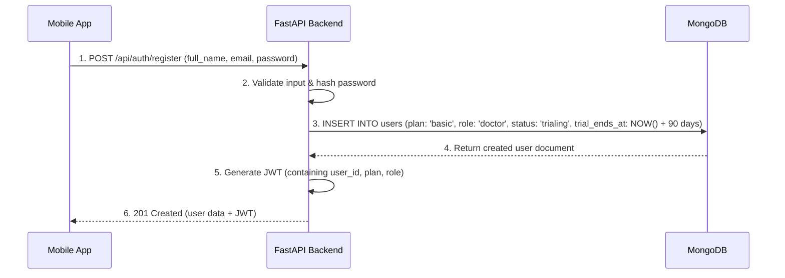
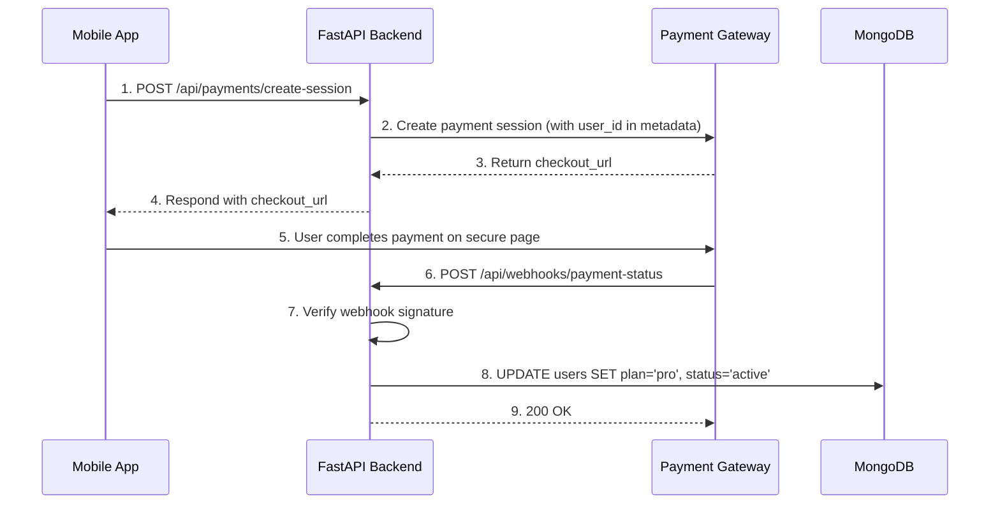

# Technical Architecture: Clinic OS Lite
**Version:** 2.0 (Consolidated)
**Date:** 2025-10-06

## 1. Overview
This document outlines the technical architecture, data models, and core workflows for the **Clinic OS Lite** application. It serves as a guide for understanding the system's design and components. For a detailed development plan and feature status, please see [`ROADMAP.md`](./ROADMAP.md).

---

## 2. High-Level System Architecture

### 2.1. Architectural Overview
The application uses a decoupled, three-tier architecture composed of two client applications, a central backend service, and managed cloud services. This model promotes separation of concerns, allowing for independent development and scaling.

The system's core is the **FastAPI backend**, which serves as the single source of truth and handles all business logic. It communicates with a **React Native mobile app** (for all users) and a planned **React.js web dashboard** (for Pro subscribers).

### 2.2. Architectural Diagram
```mermaid
graph TD
    subgraph "Clients (User-Facing Layer)"
        A[<b>Android App (React Native)</b><br><i>Target: All Users (Basic & Pro)</i><br>Handles core patient management and on-the-go tasks.]
        B[<b>Web Dashboard (React.js)</b><br><i>Status: Planned</i><br>Provides advanced analytics and data management for Pro users.]
    end

    subgraph "Backend Service (Application Layer)"
        C{<b>FastAPI Backend API</b><br><i>Central Business Logic</i><br>Stateless REST API handling authentication, data processing, and external service integration.}
    end

    subgraph "Managed Services (Data & Infrastructure Layer)"
        D[<b>MongoDB Atlas</b><br><i>Primary Datastore</i><br>NoSQL database for user and patient data.]
        E[<b>Payment Gateway (e.g., Stripe)</b><br><i>Subscription Management</i><br>Handles secure payment processing and subscription events via webhooks.]
        F[<b>Cloud Storage (e.g., AWS S3)</b><br><i>File Storage (Pro Feature)</i><br>Stores user-uploaded documents like lab reports.]
    end

    A -- "REST API Calls over HTTPS (JWT Auth)" --> C
    B -- "REST API Calls over HTTPS (JWT Auth)" --> C
    C -- "Database Operations (Motor Driver)" --> D
    C -- "Webhooks & API Calls" --> E
    C -- "Secure File Operations (SDK)" --> F
```

### 2.3. Architectural Principles
- **Stateless Backend:** The FastAPI application is stateless, enabling seamless horizontal scaling. State is managed via JWTs or retrieved from the database on demand.
- **Secure by Design:** Communication is enforced over HTTPS. Authentication relies on JWTs. Authorization is handled at the API level using a **Role-Based Access Control (RBAC)** system and pro-tier feature flags. The API is also protected from abuse via **rate limiting**.
- **Scalability & Cost-Effectiveness:** The architecture is designed for serverless compute platforms (e.g., Google Cloud Run, AWS Lambda) and leverages managed services (MongoDB Atlas, AWS S3) to reduce operational overhead.

---

## 3. Component Breakdown

### 3.1. Backend Service (FastAPI)
- **Role:** The backend is the central brain of the application. It is responsible for all business logic, data persistence, user authentication, and secure communication with third-party services.
- **Core Technologies:** Python 3.9+, FastAPI, Pydantic, Motor, `python-jose` and `passlib` for JWT authentication, and `slowapi` for rate limiting.
- **Status:** Largely complete. Provides APIs for authentication, patient management, clinical notes, and payments. It includes a robust RBAC system, rate limiting, enhanced server-side validation, and protected endpoints for documents and analytics.

### 3.2. Mobile Client (React Native)
- **Role:** The primary, on-the-go interface for all users (Basic and Pro). It is optimized for a mobile-first experience, focusing on daily tasks like patient management and note-taking.
- **Core Technologies:** React Native, Expo, Zustand for state management, and Expo Router for navigation.
- **Status:** In development. Core features like authentication, patient management, and the upgrade-to-pro flow are implemented. Document management UI is pending.

### 3.3. Web Client (React.js Dashboard)
- **Role:** A premium, Pro-exclusive interface designed for desktop use. It will provide a broader, more analytical view of the practice.
- **Core Technologies:** React.js (or a framework like Next.js), a component library (e.g., MUI), and a charting library (e.g., Recharts).
- **Status:** Planned. This application has not been built yet.

---

## 4. Data Models (MongoDB Schema)
The application enforces a consistent data structure using Pydantic models.

### 4.1. `users` Collection
Stores information about the medical professionals using the service.
```json
{
  "_id": "String (UUID)",
  "email": "String (Unique, Indexed)",
  "password_hash": "String",
  "full_name": "String",
  "phone": "String",
  "medical_specialty": "String",
  "plan": "String (Enum: 'basic', 'pro', Default: 'basic')",
  "role": "String (Enum: 'admin', 'doctor', 'patient', Default: 'doctor')",
  "subscription_status": "String (Enum: 'trialing', 'active', 'canceled', 'past_due', Default: 'trialing')",
  "subscription_end_date": "ISODate",
  "created_at": "ISODate",
  "updated_at": "ISODate"
}
```

### 4.2. `patients` Collection
Stores demographic and contact information for each patient.
```json
{
  "_id": "String (UUID)",
  "patient_id": "String (Auto-Incrementing, e.g., PAT001)",
  "user_id": "String (Indexed, Foreign key to `users`)",
  "name": "String",
  "phone": "String",
  "email": "String",
  "address": "String",
  "location": "String",
  "initial_complaint": "String",
  "initial_diagnosis": "String",
  "group": "String",
  "is_favorite": "Boolean",
  "created_at": "ISODate",
  "updated_at": "ISODate"
}
```

### 4.3. `clinical_notes` Collection
Stores timestamped clinical entries for each patient.
```json
{
  "_id": "String (UUID)",
  "patient_id": "String (Indexed, Foreign key to `patients`)",
  "user_id": "String (Indexed, Foreign key to `users`)",
  "content": "String",
  "visit_type": "String (Enum: 'regular', 'follow-up', 'emergency')",
  "created_at": "ISODate"
}
```

### 4.4. `documents` Collection (Pro Feature)
Stores metadata about files uploaded by Pro users. The files themselves are stored in a separate cloud storage service.
```json
{
  "_id": "ObjectId",
  "patient_id": "ObjectId (Indexed)", // Foreign key to `patients`
  "user_id": "ObjectId (Indexed)", // Foreign key to `users`
  "file_name": "String",
  "storage_key": "String", // Unique key/path in cloud storage
  "content_type": "String",
  "size_bytes": "Number",
  "uploaded_at": "ISODate"
}
```

---

## 5. Core Workflows
This section outlines key user journeys.

### 5.1. User Registration & Trial Activation
A new user is registered and automatically placed on a 90-day trial with a default role of `DOCTOR`.


### 5.2. Subscription Upgrade Flow
A user on a Basic/Trial plan upgrades to a paid Pro plan.


---

## 6. Deployment & Environment

### 6.1. Backend Directory Structure
The backend code is organized into a clean, service-oriented structure within `backend/app/`.
- **`api/`**: API endpoint definitions (routers), decorated with rate limits.
- **`core/`**: Core application logic, configuration, and security (`security.py` for RBAC, `limiter.py` for rate limiting).
- **`db/`**: Database session management and initialization.
- **`models/`**: Pydantic models for database collections.
- **`schemas/`**: Pydantic schemas for API request/response validation.
- **`services/`**: Business logic, separated from the API layer.

### 6.2. Production Recommendations
- **Web Server:** A production-grade ASGI server like Gunicorn with Uvicorn workers, running in a container.
- **Database:** A managed MongoDB cluster (e.g., MongoDB Atlas) is strongly recommended for automated backups, scaling, and monitoring.
- **Caching:** A caching layer (e.g., Redis) should be used for frequently accessed data to reduce database load.
- **Monitoring:** A solution like Prometheus/Grafana or a commercial APM (e.g., Datadog) to track performance.
- **Logging:** Centralized logging (e.g., ELK stack, Google Cloud Logging).
- **CI/CD:** An automated pipeline (e.g., GitHub Actions) for testing and deployment.